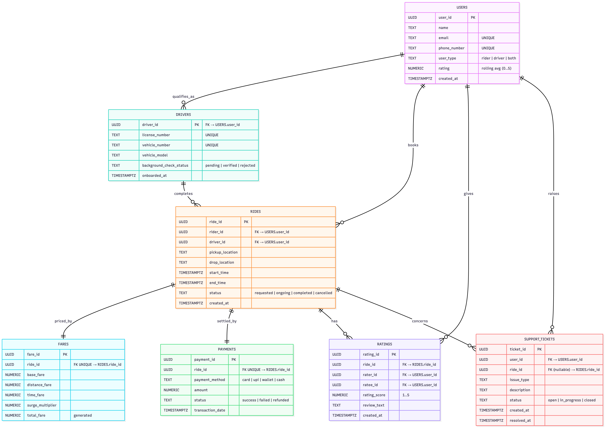

# PRODUCT DISSECTION FOR UBER (RIDE HAILING PLATFORM)

## INTRODUCTION

Uber Technologies, Inc., founded in 2009 and headquartered in San Francisco, is a global
mobility and delivery platform that has transformed how people move and access services.
Operating in more than 70 countries and 15,000+ cities, Uber connects **riders** seeking
transportation with **drivers** offering rides. Its business model centers on acting as a two-sided
marketplace, taking a service fee from each transaction while also expanding into advertising and
subscriptions like Uber One. It largely solves real-world transportation inefficiencies by ensuring
reliability, speed, and safety. Uber’s success comes from having lots of drivers and riders on the
platform, smart routing, flexible pricing, and easy payments and ratings — all of which make it a
reliable and trusted service for both users and drivers.

**Why Uber?**
● It operates in a high-impact industry (mobility & logistics).
● It has rich data requirements (matching, routing, payments, ratings).
● It faces real, complex problems (safety, fraud, demand-supply balance).
This makes it an excellent candidate for a product dissection project.

## PROBLEM STATEMENT:

Before the advent of Uber, traditional transportation systems faced major inefficiencies across
riders, drivers, and cities. Riders often struggled with unreliable availability, long wait times, and
opaque fare structures. Drivers experienced idle periods, unpredictable earnings, and limited
safety measures. Meanwhile, cities grappled with growing traffic congestion and underutilized
vehicles.

Uber set out to solve these challenges by creating a **digital, on-demand marketplace** that
seamlessly connects riders with drivers. Its platform reduces wait times through instant
demand–supply matching, ensures transparency with upfront pricing and cashless payments, and
strengthens trust with features like identity verification, real-time trip tracking, and ratings.
This project dissects Uber’s approach to redefining urban mobility by addressing long-standing
gaps in reliability, transparency, safety, and efficiency through technology-driven innovation.

## OBJECTIVES:

1. Dissect Uber’s product features and their role in problem-solving.

2. Present a real-world case study of an operational challenge.

3. Design a database schema to support Uber’s main flows.

4. Justify schema design decisions with a clear rationale.

5. Visualize with an ER Diagram.

6. Summarize findings as if presenting to stakeholders.

## PRODUCT DISSECTION AND REAL WORLD PROBLEMS SOLVED BY UBER:

Product dissection is a way of breaking down a product into its core parts to understand how it
works, what value it delivers, and which real-world problems it solves. Uber is a strong example
because it addresses multiple challenges in the traditional transportation system through
technology and smart marketplace design.

One major problem riders faced earlier was the uncertainty of finding reliable transportation,
especially during peak hours or in less accessible areas. Uber solves this by creating a dense
marketplace where riders are quickly matched with the nearest available driver, reducing wait
times.

Another common issue was fare unpredictability and disagreements over pricing; Uber’s upfront
and transparent pricing strategy ensures riders know the cost before booking, while dynamic
pricing helps balance demand and supply during busy times. For drivers, the problem of idle time
and inconsistent earnings has long been a challenge in the taxi industry—Uber’s algorithmic
matching and flexible work model provide drivers with a steady stream of ride requests and the
ability to work on their own terms.

Safety, both for riders and drivers, is another real-world concern that Uber addresses with
identity verification, GPS trip tracking, two-way ratings, and built-in emergency features.

Finally, payment friction in traditional cabs, such as lack of change or limited options, is
eliminated by Uber’s seamless digital payment system that supports cards, wallets, and UPI in
many markets. Together, these problem-solution strategies illustrate how Uber has redefined
urban mobility and created a scalable, trusted platform that benefits both consumers and earners.

In conclusion, Uber's product design has successfully tackled real-world problems by creating a
platform that nurtures reliability, fosters speed, and offers a space for safe travel. Through its
diverse features, Uber addresses the need for speedy transportation, transparency, and flexibility,
shaping the digital landscape and providing practical solutions to the evolving needs of its global
user base.

## Top Features of Uber:

1. **User Profiles (Riders & Drivers)**
    Uber maintains distinct but interconnected profiles for both riders and drivers. Riders’
    profiles include identity, payment methods, and trip history, while drivers’ profi les add
    vehicle details, license verification, and background checks.

2. **Ride Booking & Matching**
    The core of Uber is the ability for riders to request a ride with a single tap. Uber’s system
    uses GPS-based matching algorithms to connect the rider with the nearest available
    driver, reducing wait time. This instant matching creates efficiency for both sides and
    ensures high marketplace liquidity.

3. **Real-Time GPS Tracking**
    Every trip on Uber is tracked live using GPS. Riders can see their driver approaching,
    track their journey in real-time, and share the trip with friends or family. Drivers benefit from navigation assistance, which reduces uncertainty in routes and enhances time efficiency.

4. **Dynamic Pricing & Fare Estimates**
    Uber calculates fares upfront using algorithms that consider distance, time, and traffic.
    During high demand, it applies surge pricing to encourage more drivers to come online,
    balancing supply and demand. This ensures riders get availability even during peak times,
    while drivers are fairly compensated.

5. **Ratings & Reviews System**
    After every trip, riders and drivers rate each other on a 5-star scale and can leave written
    feedback. These ratings directly impact future matches—drivers with consistently poor
    ratings may be removed, while riders also face accountability. This two-way system
    fosters trust and improves service quality over time.

6. **Payments & Wallet Integration**
    Uber offers seamless payment through in-app methods like credit/debit cards, digital
    wallets, and UPI, depending on the market. Cash is also supported in regions where
    digital penetration is low, but all payments are logged digitally. Receipts are
    automatically generated, simplifying transactions and reducing disputes.

7. **Safety Features**
    Uber prioritizes safety with multiple layers: driver background verification, trip tracking,
    and an in-app SOS button that connects users with emergency services. Riders can also
    share live trip details with trusted contacts. Drivers benefit from insurance coverage and
    verification of rider identities in some markets.

8. **Customer Support System**
    Uber integrates a help center within the app for riders and drivers. Issues like
    cancellations, payment disputes, or safety concerns can be reported directly, often with
    automated solutions like instant refunds. When automation isn’t enough, users can
    escalate to 24/7 human support.

**Conceptual Model of the Uber schema**

## Schema Description for Uber:

The schema for Uber involves multiple entities that represent different aspects of the platform.
These entities include Users, Drivers, Riders, Ride, GPS tracking, Fares, Payments and more.
Each entity has specific attributes that describe its properties and relationships with other entities.

### **User Entity:**
Users are at the core of Uber. The user entity contains all individuals using the platform,
classified as riders or drivers. Stores basic identity, contact, and role-based details.

**1.User_ID (PK):** A unique identifier for each user

**2. Name:** Full name of the user.

**3. Email:** The user's email address for account-related communication.

**4. Phone_number:** User’s phone number for easier communication.

**5. User_type (rider/driver):** As riders and drivers are both users, we need to know their
type.

**6. Rating:** For role based two-way rating.

### **Driver Entity:**
Extends the user entity for drivers by storing vehicle and verification details. Ensures trust and
compliance for onboarding.

**1. Driver_ID (PK, FK → user_id)** : A unique identifier for each driver

**2. License_number** : driving licence number of the driver

**3. Vehicle_number** : registered number of the vehicle

**4. Vehicle_model** : Type of vehicle

**5. Background_check_status:** if the background is checked and verified.

### **Ride (Trip) Entity:**
Represents each ride request and completion on the platform. Tracks details from booking to
payment.

**1. Ride_id (PK)** : A unique identifier for each ride.

**2. Rider_id (FK → user_id)** : ID of the rider.

**3. Driver_id (FK → user_id)** : ID of the driver of that particular trip

**4. Pickup_location** : Pickup location of the ride.

**5. Drop_location** : Drop location of the ride.

**6. Start_time** : Start time of the trip

**7. End_time** : End time of the trip

**8. Status** (requested/ongoing/completed/cancelled): Status of the ride.

### **Fare & Pricing Entity:**
Stores fare details, including dynamic pricing logic applied to each ride.

**1. Fare_id (PK)** : A unique identifier for each fare.

**2. Ride_id (FK → ride_id)** : ID of the ride

**3. Base_fare:** The minimum fare for the trip.

**4. Distance_fare** : The fare according to the distance

**5. Time_fare** : The fare according to the time.

**6. Surge_multiplier** : Fare in case of demand or traffic surge.

**7. Total_fare** : Final total fare of the ride.

### **Payment Entity:**
Represents transactions between riders and Uber (and indirectly to drivers). Handles multiple
payment methods.

**1. Payment_id (PK)** : A unique identifier for each payment.

**2. Ride_id (FK → ride_id)** : ID of the ride for which the payment is done.

**3. Payment_method** (card/UPI/wallet/cash): Method of the payment done.

**4. Amount** : Amount of the ride

**5. Status** (success/failed/refunded): Status of the payment

**6. Transaction_date** : Date of the transaction.

### **Rating & Review Entity:**
Stores feedback after each ride from both riders and drivers. Ensures accountability and service
quality.

**1. Rating_id (PK)** : A unique identifier of the rating

**2. Ride_id (FK → ride_id)** : ID of the ride for which the rating is being given.

**3. Rater_id (FK → user_id)** : ID of the rater, it is from both sides, the driver and the rider.

**4. Ratee_id (FK → user_id)** : ID for which rating is done, it is from both sides, the driver
and the rider.

**5. Rating_score** : Score out of five stars is stored in this column.

**6. Review_text** : review in text format.

**7. Created_at** : Date at which the rating and review is given.

### **Support Ticket Entity** :
Represents complaints, queries, or safety issues raised by riders or drivers.
**1. Ticket_ID (PK):** A unique identifier of the support ticket.

**2. User_ID (FK → user_id)** : ID of the user: driver/rider who is raising the ticket.

**3. Ride_ID (FK → ride_id)** : The ID of the ride for which the ticket is being raised.

**4. Issue_type** : the reason for the complaint: safety, delayed trip, inconvenience, etc.

**5. Description** : Description of the issue or the query.

**6. Status** (open/closed/in-progress): Status of the support ticket.

**7. Created_at** : Date at which the support ticket was raised.

**8. Resolved_at** : Date at which the ticket was resolved.

Relationships are:
● **User – Ride** : A user (rider) can book many trips, but each trip belongs to one user.

● **Driver – Ride** : A driver can complete many trips, but each trip is handled by one driver.

● **Ride – Payment** : Each trip generates one payment record, and each payment is tied to a
single trip.

● **Ride – Rating** : Every trip can have one rating from the rider and one from the driver.

● **User – Rating** : A user can give multiple ratings, but each rating is linked to a specific
trip.

● **Driver – Rating** : A driver can receive multiple ratings, but each is tied to one trip.

● **User – Support Ticket** : A user can raise multiple support tickets, but each ticket belongs
to one user.

● **Ride – Support Ticket** : A support ticket may reference a trip if it concerns a specific
ride.

## ER Diagram.

## Rationale and Strategy:

The schema design was created to reflect Uber’s core goal of seamlessly connecting riders and drivers while ensuring transparency, scalability, and reliability. Entities such as User , Driver , and Ride form the backbone, capturing the essential interaction of booking and completing trips. Supporting entities like Payment and Rating ensure secure transactions and feedback mechanisms that build trust and quality in the platform. Relationships were structured to maintain clear linkages, avoid redundancy and ensuring Data consistency. Overall, this design balances efficiency, integrity, and scalability, Aligning with Uber’s strategy to deliver a smooth and trustworthy ride-sharing experience.

## Conclusion

In this case study, we delved into the design of Uber's schema and Entity-Relationship diagram.
Uber has revolutionised the way people travel. The platform's intricate data model, consisting of
entities like GPS location, pre-book fares, support ticket, flexible payment, hashtags, and review
and ratings forms the foundation for its seamless functionality. By understanding this schema, we
gain insight into how Uber effectively manages the complexities of rider_driver interactions
contributing to its widespread popularity and continued growth in the world of logistics.

